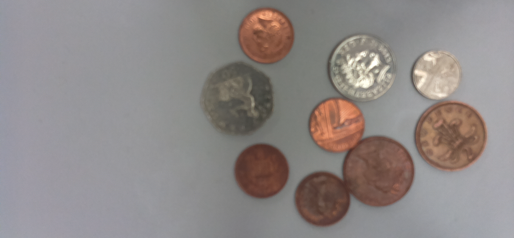
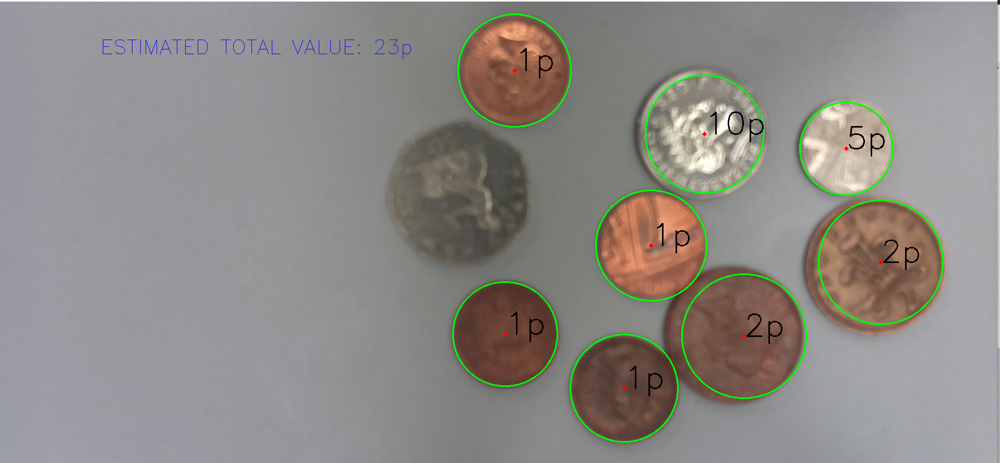

hello in this project wright small python program that detects the circles on the image and labels them to preset coins clusters then It get the sum of all coin truly detected and wright it on screen

Here is an example

Input

Output

